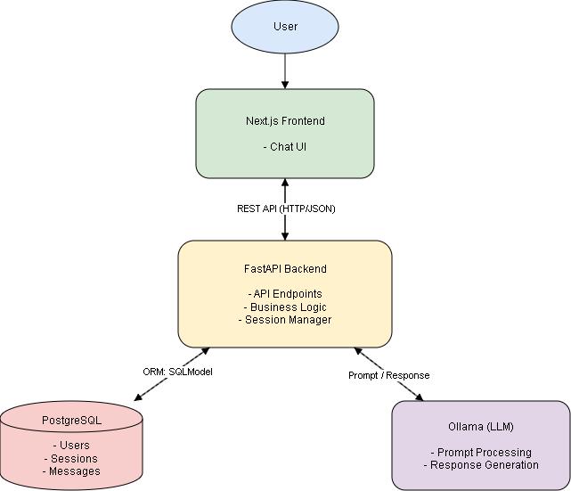

# Tech Stack Decisions

## Frontend – Next.js (React + TypeScript)

We chose Next.js to build a structured chat interface using reusable components. This is important for displaying conversations, user input, and dynamic responses.

TypeScript helps us avoid errors when handling API data between frontend and backend.

---

## Backend – FastAPI (Python)

We use FastAPI to handle chat requests, manage user sessions, and process communication with the AI model.

It allows us to quickly define API endpoints and automatically validates incoming data, which improves reliability when users send messages or requests.

Python also makes it easier to integrate AI functionality.

---

## Database – PostgreSQL

We use PostgreSQL to store users, chat sessions, and message history.

A relational database is important because our system needs to manage structured relationships, such as which messages belong to which user or session.

---

## ORM – SQLModel

We use SQLModel to define database models and interact with the database in a simple way.

It reduces complexity compared to raw SQL and helps us quickly implement operations like creating and retrieving chat messages.

We also chose it because it is new to our team, giving us the opportunity to learn a modern tool.

---

## AI Layer – Ollama (Llama 3.2 3B)

We use Ollama to run our language model locally because it is easy to set up and beginner-friendly compared to other LLM deployment options.

This allows us to integrate AI functionality into our system without relying on external APIs, which simplifies development and avoids additional configuration effort.

The lightweight model allows us to run the system efficiently on local hardware, which is ideal for a student project and makes our setup easy to reproduce.

---

## Communication – REST API

We use a REST API to connect the frontend and backend in a clear and structured way.

Each endpoint has a defined responsibility (e.g., handling chat messages or managing sessions), which helps us separate concerns within the system.

By defining specific HTTP methods (such as POST for creating messages), we can control how the API is used and ensure consistent behavior.

This structure also makes it easier to test individual endpoints, validate requests, and debug the system.

---

## ESBot Architecture and Data Flow

The following diagram shows how the different components of ESBot interact with each other.

User input is sent from the frontend to the backend via the REST API, where it is processed, stored in the database, and forwarded to the AI model.

The generated response is then returned through the backend to the frontend, allowing the user to continue the conversation.

