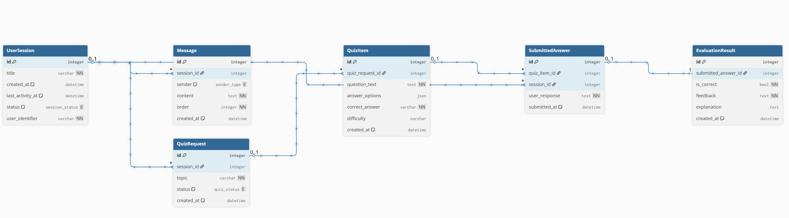

# Data Model Documentation

## Core Entities

The ESBot domain model consists of the following core entities:

1. **UserSession**: Represents a user session for interacting with the bot.
2. **Message**: Individual messages in a conversation (user or AI).
3. **QuizRequest**: A request for generating a quiz on a specific topic.
4. **QuizItem**: Individual questions within a quiz.
5. **SubmittedAnswer**: User responses to quiz questions.
6. **EvaluationResult**: AI-generated evaluation of submitted answers.

## Relationships

- UserSession 1:N Messages
- UserSession 1:N QuizRequests
- QuizRequest 1:N QuizItems
- QuizItem 1:N SubmittedAnswers
- SubmittedAnswer 1:1 EvaluationResult
- SubmittedAnswer N:1 UserSession (audit trail)

## Persistence Strategy

The application uses a relational database (PostgreSQL) for persistence. This choice is justified by:

- Need for complex queries across related entities (e.g., session history, quiz progress)
- Referential integrity to prevent orphaned records
- Transaction support for multi-step operations (e.g., quiz generation and evaluation)
- Efficient joins for reporting and analytics

The models are implemented using SQLAlchemy/SQLModel for type safety and ORM capabilities.

## Entity-relationship Diagram

## Constraints and Validation

- All entities have primary keys (auto-incrementing integers)
- Foreign keys enforce referential integrity
- Nullable fields are explicitly marked
- Enums used for status and sender fields
- Timestamps default to current time
- Indexes on foreign keys and timestamps for performance
- JSON field for flexible answer options in QuizItem