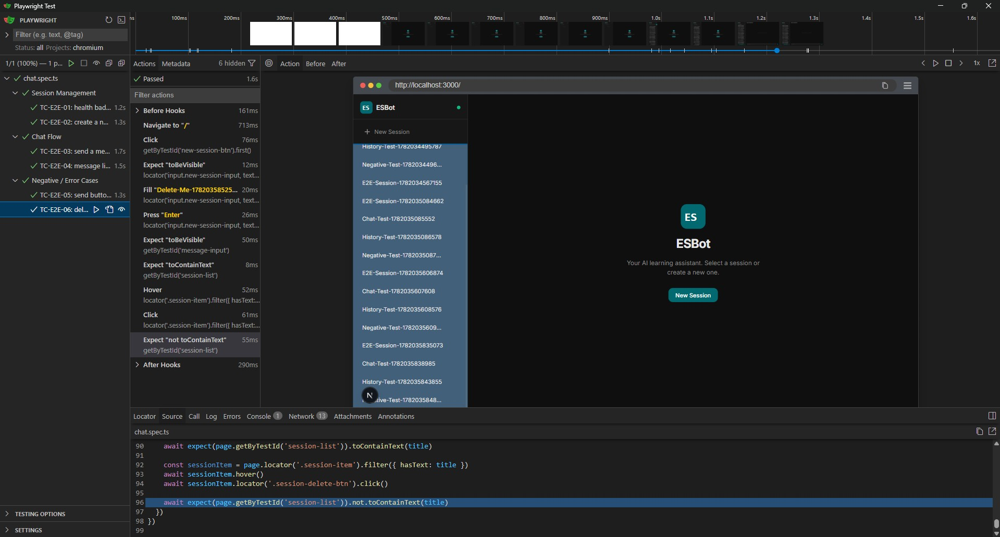

# E2E Test Execution Report - ESBot

## 1. Test Execution Summary

| Property      | Value                                            |
| ------------- | ------------------------------------------------ |
| Framework     | Playwright                                       |
| Version       | `@playwright/test` (see `frontend/package.json`) |
| Browser       | Chromium                                         |
| Total tests   | 6                                                |
| Passed        | 6                                                |
| Failed        | 0                                                |
| Total runtime | ~5.7s (headless) / ~1.6s per test (UI mode)      |
| Run date      | 2026-06-21                                       |
| Tester        | N                                                |
| Environment   | Windows 11, Docker stack on localhost:3000       |

All 6 tests passed on a clean run without retries.

---

## 2. Headless Output

Terminal output from `npx playwright test` (CI-style, no browser window):

```
PS D:\VSCode\ESBot\esbot\frontend> npx playwright test

Running 6 tests using 1 worker

  ✓  1 [chromium] › playwright\chat.spec.ts:24:7 › Session Management › TC-E2E-01: health badge is visible on load (632ms)
  ✓  2 [chromium] › playwright\chat.spec.ts:29:7 › Session Management › TC-E2E-02: create a new session and see it in sidebar (731ms)
  ✓  3 [chromium] › playwright\chat.spec.ts:40:7 › Chat Flow › TC-E2E-03: send a message and receive AI reply (949ms)
  ✓  4 [chromium] › playwright\chat.spec.ts:61:7 › Chat Flow › TC-E2E-04: message list shows history after reload (860ms)
  ✓  5 [chromium] › playwright\chat.spec.ts:83:7 › Negative / Error Cases › TC-E2E-05: send button disabled when input is empty (658ms)
  ✓  6 [chromium] › playwright\chat.spec.ts:94:7 › Negative / Error Cases › TC-E2E-06: delete a session removes it from list (793ms)

  6 passed (5.7s)
```

---

## 3. Interactive Run Screenshot

The screenshot below was captured during `npx playwright test --ui`. All 6 tests are shown as passing (green). The trace panel on the right shows the live browser at the final step of TC-E2E-06 (delete session), confirming the session was removed from the sidebar list.



_Playwright UI mode - `chat.spec.ts`, 1/1 (100%) - 6 hidden, all passed, Chromium_

---

## 4. Flakiness Observations

No flakiness was observed across multiple runs. All 6 tests passed consistently in both headless and headed mode.

The initial test run (before fixing the spec) produced 5 failures. The root cause was a **race condition** in the session creation flow: tests proceeded to look for `message-input` immediately after clicking "Create", before the frontend had finished navigating to the new session's chat view. This was resolved by introducing a shared `createSessionAndOpen` helper that explicitly waits for `data-testid="message-input"` to become visible before continuing.

No LLM non-determinism issues were observed because the AI reply is currently a **deterministic mock** (`"Hello, your question was: ..."`) - the test only asserts that the reply is non-empty and has length > 0, which is always satisfied.

---

## 5. Reflection

### What was easy about writing E2E tests compared to unit or API tests?

E2E tests are written from the user's perspective, which makes them highly readable and close to the BDD scenarios already defined. Playwright's auto-waiting removes a large class of boilerplate that would otherwise be needed with lower-level tools - no manual `sleep()` calls, no explicit polling loops. The `--ui` mode and built-in trace viewer make failures immediately understandable without needing to instrument the code.

### What was difficult or surprising?

The most surprising aspect was how sensitive E2E tests are to **UI navigation timing**. Even a short async gap between a button click and a DOM update caused test failures when the next assertion ran too early. The fix - waiting for a concrete element to be visible rather than assuming a fixed delay - is the correct Playwright pattern, but it requires thinking carefully about which UI element signals "this step is complete".

A secondary challenge was **state leakage between runs**: the shared database accumulates sessions from previous test runs, which means the sidebar always contains old sessions. The tests use `Date.now()`-based unique titles to work around this, but a proper solution would use isolated test databases or a cleanup hook.

### At which layer of the test pyramid would you detect each bug?

| Bug                                           | Layer       | Reason                                                                                           |
| --------------------------------------------- | ----------- | ------------------------------------------------------------------------------------------------ |
| Send button not disabled on empty input       | E2E or unit | A unit test on the button's `disabled` prop catches it cheapest; E2E confirms it in the real DOM |
| Session not appearing in sidebar after create | E2E         | Requires a real API call + state update + re-render - not detectable at unit level               |
| AI reply not stored in DB                     | API         | A direct `POST /sessions/{id}/messages` test catches this without a browser                      |
| Health dot invisible due to wrong CSS class   | E2E         | Purely a rendering issue - only visible in a real browser context                                |
| Delete session not removing from UI           | E2E         | Requires interaction + optimistic update verification                                            |

### How would these tests behave with a real LLM? What would you change?

With a real LLM the reply is non-deterministic in content and variable in latency (potentially several seconds). The current assertion (`aiText.length > 0`) would still hold, but the 10-second timeout on `assistant-message` visibility might occasionally be too short. The tests would need a longer timeout (e.g. 30s) and potentially a streaming indicator assertion to avoid flakiness. More importantly, any assertion on the specific reply text would need to be removed entirely - only structural assertions (reply exists, is non-empty, is shown in the correct bubble) would remain valid.
